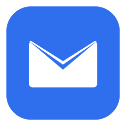
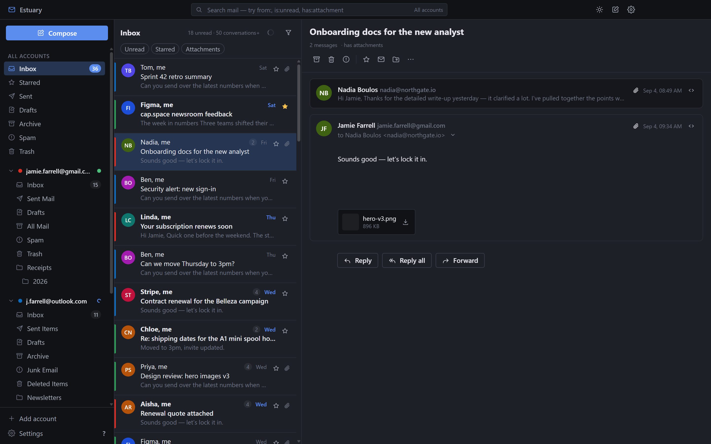

<div align="center">



# Estuary

**Every inbox, one tide.**

A free, open-source desktop email client for Windows that puts Gmail, Outlook / Microsoft 365,
Spacemail and any other IMAP account into a single fast inbox — and keeps your mail on your own PC.

[**Download for Windows**](https://github.com/TheJamieFarrell/estuary/releases/latest/download/Estuary-Setup.exe) · [estuary.email](https://estuary.email) · MIT licensed

</div>



## What it is

Estuary is a real mail client, not a wrapper around a web page. It speaks IMAP and SMTP directly,
caches everything in a local SQLite database, and renders a native UI on top of that cache. The
list you scroll is served from disk, so it is quick, and it still works when the network is not.

Built with Electron, React and TypeScript. One codebase, currently packaged for Windows.

## Features

- **One unified inbox.** Gmail, Outlook / Microsoft 365, Spacemail (Spaceship), iCloud, Yahoo,
  Fastmail and any other IMAP server, merged into a single date-ordered list — or browsed one
  account at a time.
- **Actions that stick.** Archive, delete, star, mark read/unread, move and report spam apply
  instantly in the UI, queue locally, and replay to the server. Archive does the right thing per
  provider (Gmail's All Mail, Outlook's Archive folder, a created `Archive` elsewhere).
- **Proper threading.** Gmail threads use `X-GM-THRID`; everything else is stitched from
  `References` / `In-Reply-To`, falling back to normalised subject plus participants within a
  7-day window.
- **Instant offline search.** Runs against the local cache with `from:`, `is:unread` and
  `has:attachment` operators. Results appear as you type.
- **Compose with attachments.** A TipTap rich-text composer in its own window so it floats beside
  the inbox. Cc/Bcc, contact autocomplete drawn from your own mail, quoted replies and forwards,
  drafts saved back to the account.
- **Notifications and tray.** New-mail notifications that open the conversation when clicked, a
  tray icon with an unread badge, close-to-tray, start-on-login, and `mailto:` handling.
- **Safe HTML mail.** Sanitised with DOMPurify and rendered in a sandboxed iframe under a strict
  CSP. Remote images are blocked until you allow them, per message or globally.
- **Light and dark themes**, a compact density option, and full keyboard navigation.
- **In-app updates** from GitHub Releases, verified by SHA-512 and installed without a UAC prompt.

## Download

[**Estuary-Setup.exe**](https://github.com/TheJamieFarrell/estuary/releases/latest/download/Estuary-Setup.exe) — Windows 10/11, roughly 115 MB.

The build is **not code-signed**, so Windows SmartScreen may warn about an unrecognised app.
Choose **More info → Run anyway**. The installer is per-user (`%LOCALAPPDATA%\Programs\Estuary`),
which is also why updates never need an administrator prompt.

## Requirements

- Windows 10 or 11 (x64)
- Nothing else — Electron ships inside the installer

To build from source you also need **Node.js 20 or newer**.

## Setting up accounts

Open **Settings → Accounts → Add account** and type your email address. Estuary picks the server
settings from its provider presets, then falls back to Thunderbird's autoconfig database and DNS
SRV records for domains it does not recognise. **Test connection** checks IMAP and SMTP separately
before anything is saved.

| Provider | How you sign in |
| --- | --- |
| **Gmail** | Fastest: a Google **app password** (turn on 2-Step Verification, generate a 16-character password, paste it in). Recommended: OAuth with your own free “Desktop app” client — see below. |
| **Outlook / Microsoft 365** | **OAuth only.** Microsoft has switched off basic authentication for IMAP and SMTP on personal accounts, and app passwords no longer work for mail. |
| **Spacemail (Spaceship)** | Your **mailbox** password from Spaceship — not your Spaceship account password. |
| **iCloud, Yahoo, Fastmail** | An **app-specific password**; the wizard links to the right page for each. |
| **Any other IMAP/SMTP server** | Address and password, with servers detected or typed in by hand. |

### OAuth needs a client ID you register yourself

Estuary is a personal project rather than a Google-verified product, so it ships with no
credentials of its own. For Gmail and Outlook you register a free OAuth client under your own
account — about ten minutes per provider, once — and paste the client ID into
**Settings → Accounts → OAuth clients**.

**[docs/OAUTH-SETUP.md](docs/OAUTH-SETUP.md)** walks through every screen of both consoles,
including the Google “Testing” caveat that expires refresh tokens after 7 days and how to avoid it.

Sign-in uses the loopback flow from RFC 8252: your system browser opens, you approve, and the
authorization code comes back to a one-shot listener on `127.0.0.1`. PKCE (S256) is always used and
there is no embedded browser.

## Privacy

- **Your mail lives on your PC.** Messages, threads, folders, drafts and settings sit in a SQLite
  database under `%APPDATA%\Estuary`, alongside a per-account attachment cache.
- **Secrets are encrypted at rest.** Passwords and OAuth refresh tokens are encrypted with
  Electron's `safeStorage` — Windows DPAPI, keyed to your Windows account — and stored as blobs.
  They are never sent to the renderer process.
- **No telemetry, no analytics, no crash reporting, no accounts.** There is no Estuary server to
  send anything to.
- The only network connections Estuary makes are to **your mail servers**, to **Google/Microsoft**
  during OAuth sign-in, and to **GitHub Releases** when it checks for an update.

Removing an account deletes its messages and its attachment folder. To reset the app completely,
quit it and delete `%APPDATA%\Estuary`.

## Building from source

```bash
git clone https://github.com/TheJamieFarrell/estuary.git
cd estuary
npm install
npm run dev     # electron-vite dev server + Electron, hot reload for the UI
```

| Command | What it does |
| --- | --- |
| `npm run dev` | Dev server and Electron with hot reload |
| `npm run build` | Type-safe production bundle into `out/` |
| `npm run dist` | Build + NSIS installer into `release/` |
| `npm run dist:dir` | Build + unpacked app into `release/win-unpacked/` (fast, no installer) |
| `npm run typecheck` | `tsc` over main/preload and renderer |
| `npm test` | vitest (pure-logic tests) |
| `node scripts/gen-icons.mjs` | Regenerate the app and tray icons |

The renderer also runs in a plain browser against seeded mock data — useful for UI work without
launching Electron:

```bash
npx vite --config vite.mock.config.ts --port 5179
# http://localhost:5179/index.html    main window
# http://localhost:5179/compose.html  compose window
```

## Project layout

```
src/shared/     types.ts + ipc.ts — the contract between main and renderer
src/main/       app shell (windows, tray, menu, IPC), db/, mail/, auth/
src/preload/    contextBridge → window.api
src/renderer/   React UI (inbox, reader, search, compose, settings)
resources/      app icon and tray icons
docs/           architecture, OAuth guide, and the estuary.email landing page
```

**[docs/ARCHITECTURE.md](docs/ARCHITECTURE.md)** has the module map, the sync and threading design,
and the conventions the codebase follows.

## Updates

Installed copies check the latest GitHub release for an `update.json` manifest, compare versions,
and offer the update. The downloaded installer is verified against the SHA-512 in that manifest
before it is launched, and because the app installs per-user the update runs without elevation.
You can turn automatic checks off in Settings.

## Contributing

Bug reports and pull requests are welcome — see **[CONTRIBUTING.md](CONTRIBUTING.md)** for how to
run the app, what to check before opening a PR, and the conventions the code follows.

## Licence

MIT — see [LICENSE](LICENSE). Copyright © 2026 Jamie Farrell.
